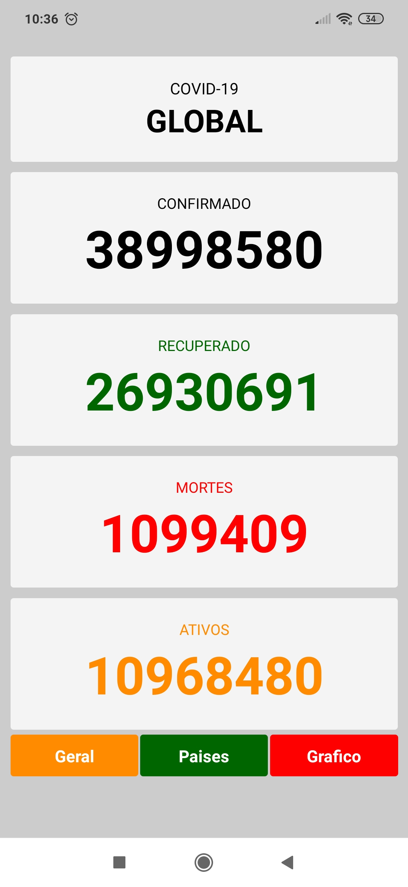
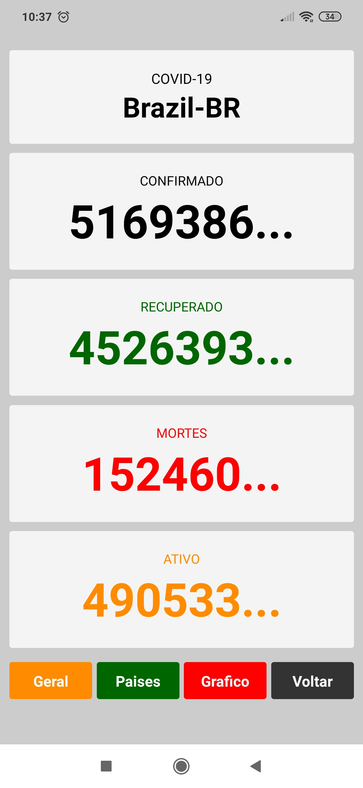
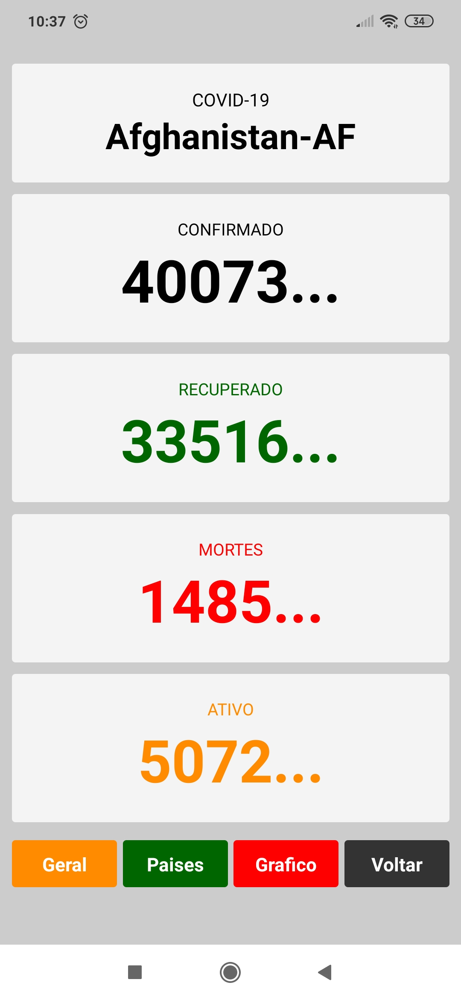

# COVID-19

# 📔 Sobre

Projeto simples onde mostra a quantidade de pessoas infectadas, curadas, recuperadas e mortes. 

Mostra Global, e também pode escolher um país. E mostra os mesmo dados do país selecionado.

---
# 🌎 API
## API Desenvolvida com: 

    React Native usando a plataforma EXPO.
    

---

## Dependências: 

    "axios": "^0.19.2",
    "expo": "~37.0.3",
    "expo-constants": "~9.0.0",

---

---
## 📱 Mobile

---
<h1 align="center">💻 Desenvolvido Por: Gilberto Júnior</h1> 